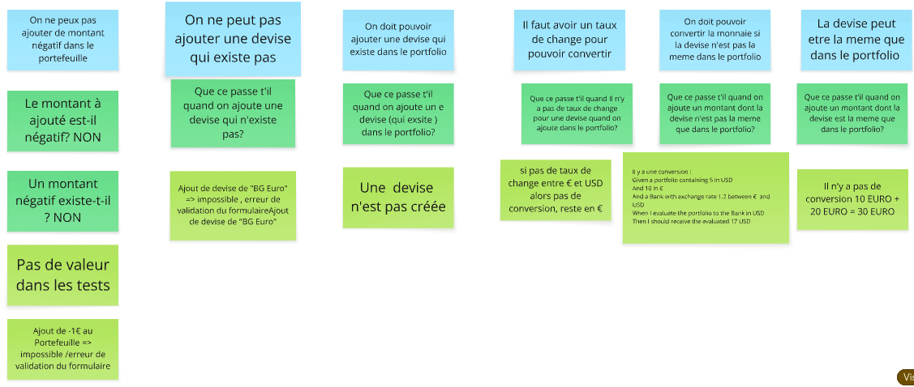

# Example Mapping

## Format de restitution
*(rappel, pour chaque US)*

```markdown
## Titre de l'US (post-it jaunes)

> Question (post-it rouge)

### Règle Métier (post-it bleu)

Exemple: (post-it vert)

- [ ] 5 USD + 10 EUR = 17 USD
```

Vous pouvez également joindre une photo du résultat obtenu en utilisant les post-its.

## Évaluation d'un portefeuille

### Portfolio

> Que ce passe t'il quand on ajoute une devise qui n'existe pas?

#### On ne peut pas ajouter une devise qui existe pas

Exemple:
```
Ajout de devise de "Yen" => impossible , erreur de validation du formulaireAjout de devise de "Yen"
```

> Que ce passe t'il quand on ajoute un e devise (qui exsite ) dans le portfolio?

#### On doit pouvoir ajouter une devise qui existe dans le portfolio

Exemple:
```
Une nouvelle devise est crée
```
> Que se passe-t-il s'il manque un taux de change lors de l'évaluation ?

### Il faut un taux de change pour évaluer dans une devise cible

Exemple:
```
Portfolio contient 5 USD et 10 EUR, Bank sans taux EUR->KRW
      => évaluation en KRW impossible : erreur "EUR->KRW"
```

> Que ce passe t'il quand on ajoute un montant dont la devise n'est pas la meme que dans le portfolio?
 
#### On doit pouvoir convertir la monnaie si la devise n'est pas la meme dans le portfolio

Exemple:
```
Il y a une conversion :Given a portfolio containing 5 in USD And 10 in €  And a Bank with exchange rate 1.2 between € and USD When I evaluate the portfolio to the Bank in USD Then I should receive the evaluated 17 USD
```

> Que ce passe t'il quand on ajoute un montant dont la devise est la meme que dans le portfolio?
 
#### La devise peut etre la meme que dans le portfolio

Exemple:
```
Il n'y a pas de conversion 10 € + 20 € = 30€
```

> Que ce passe t'il quand on ajoute un montant négatif dans le portfolio?
 
#### On ne peux pas ajouter de montant négatif dans le portefeuille

Exemple:
```
Ajout de -1€ au Portefeuille => impossible /erreur de validation du formulaire
```


