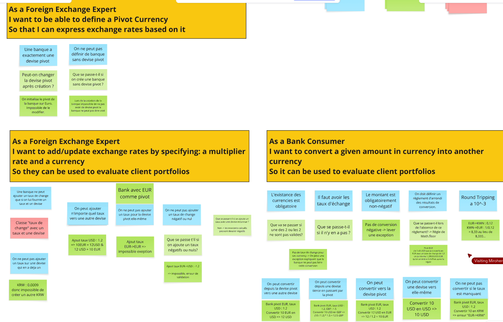

# Example Mapping

## Format de restitution
*(rappel, pour chaque US)*

```markdown
## Titre de l'US (post-it jaunes)

> Question (post-it rouge)

### Règle Métier (post-it bleu)

Exemple: (post-it vert)

- [ ] 5 USD + 10 EUR = 17 USD
```

Vous pouvez également joindre une photo du résultat obtenu en utilisant les post-its.

## Story 1: Define Pivot Currency

```gherkin
As a Foreign Exchange Expert
I want to be able to define a Pivot Currency
So that I can express exchange rates based on it
```

### Une banque a exactement une devise pivot

Exemple :
``` On initialise le pivot de la banque sur Euro. Impossible de le modifier. ```

### On ne peut pas définir de banque sans devise pivot.

Exemple :
``` Lors de la création de la banque impossible de ne pas avoir de devise pivot la banque ne peut pas être créé. ```


## Story 2: Add an exchange rate
```gherkin
As a Foreign Exchange Expert
I want to add/update exchange rates by specifying: a multiplier rate and a currency
So they can be used to evaluate client portfolios
```
### Le taux est toujours défini depuis la devise pivot.

Exemple :
```Bank avec EUR comme pivot, ajout taux USD : 1.2 => 10EUR = 12USD & 12 USD = 10 EUR ```

### On ne peut pas ajouter un taux pour la devise pivot elle-même
Exemple :
```Bank avec EUR comme pivot, ajout taux EUR->EUR => impossible, erreur de validation```

### On ne peut pas ajouter un taux de change négatif ou nul

Exemple :
``` Bank avec EUR comme pivot, ajout taux EUR->USD : -1.2 => impossible erreur de validation```

### On ne peut pas ajouter un taux sur une devise qui en a deja un
Exemple : 
``` KRW->Eur : 0.0009 donc impossible de créer un autre KRW->Eur ``` 

## Story 3: Convert a Money

```gherkin
As a Bank Consumer
I want to convert a given amount in currency into another currency
So it can be used to evaluate client portfolios
```
### L'existance des currencies est obligatoire & Il faut avoir les taux d'échange

Exemple :
```Pas de taux de change pour ces currency -> On jette une exception expliquant que la banque ne peut pas faire cette conversion```

### Le montant est obligatoirement non-négatif

Exemple :
```Pas de conversion négative -> jeter une exception```

### On doit définir un règlement d'arrondi des résultats de conversion.

Exemple :
``` J'ai 1.45 USD que je convertis en EUR avec un taux de change de 1.2 de EUR->USD ce qui donne 1,208333333 EUR qu on arrondi à 3 chiffres apres la vigule ```

### On peut convertir depuis la devise pivot vers une autre devise

Exemple :
```Bank pivot EUR, taux EUR->USD : 1.2  Convertir 10 EUR en USD => 12 USD```

### On peut convertir depuis une devise tierce en passant par la pivot
Exemple :
``` Bank pivot EUR, taux EUR->USD : 1.2, EUR->GBP : 1.5  Convertir 10 USD en GBP => (10 / 1.2) * 1.5 = 12.5 GBP ```
#### On peut convertir vers la devise pivot
Exemple : 
``` Bank pivot EUR, taux USD : 1.2  Convertir 12 USD en EUR => 12 / 1.2 = 10 EUR ```

### On peut convertir une devise vers elle-même

Exemple :
``` Convertir 10 USD en USD => 10 USD ```

### On ne peut pas convertir si le taux est manquant

Exemple :
``` Bank pivot EUR, taux EUR->USD : 1.2  Convertir 10 EUR en KRW => erreur "EUR->KRW" ```

### Si on convertis un montant d'une devise A vers une devise B, puis qu'on reconvertis le résultat de B vers A, on dois retrouver le montant de départ à 3 chiffres après la virgule près => Round Tripping à 10^-3: Round Tripping a 10^-3
Exemple :
``` EUR->KWN : 0,12 KWN->EUR : 1/0,12 = 8,33 au lieu de 8,333... ```